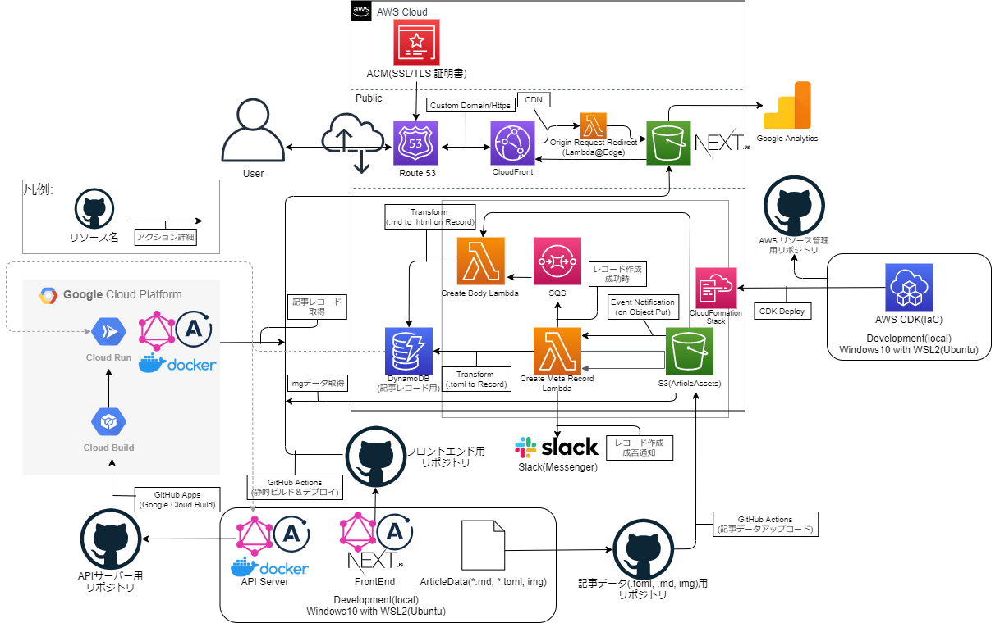
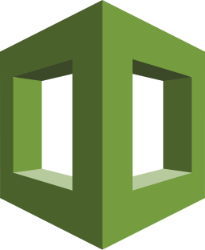

# sublog-architecture v2.0

[sublog](https://github.com/fijixxx/sublog) の環境構成図です。

## レイヤー別技術スタック一覧

svg アイコンは https://svgporn.com/ よりお借りしました

### **FrontEnd**

 
 
 
 

 
TypeScript/ Next.js/ GraphQL/ Apollo Client

 
 
 
 
 

 
Google Analytics/ Cloudinary/ Amazon S3/ Amazon CloudFront/ Lambda@Edge

### **API**

 
 
 
 
 

 
TypeScript/ GraphQL/ Apollo Server/ Docker/ Cloud Run

### **Infra**

 
 
 
 

Amazon DynamoDB/ AWS Lambda/ Amazon SQS/ Amazon S3

 
 
 
 

Amazon Route53/ AWS CloudFormation(AWS CDK)/ GitHub, GitHub Actions, GitHub Apps/ Slack

 
 

TypeScript/ Python

